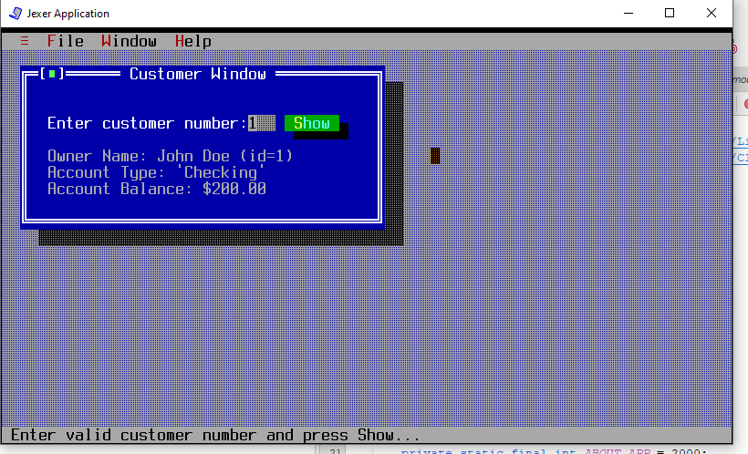
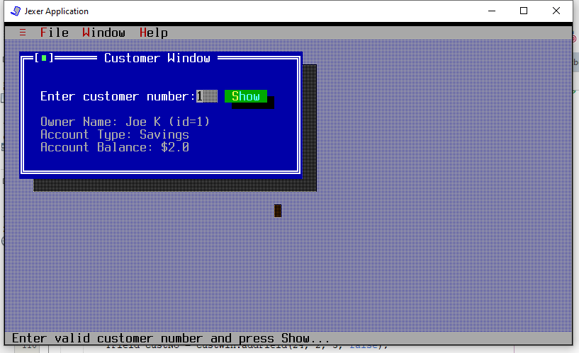
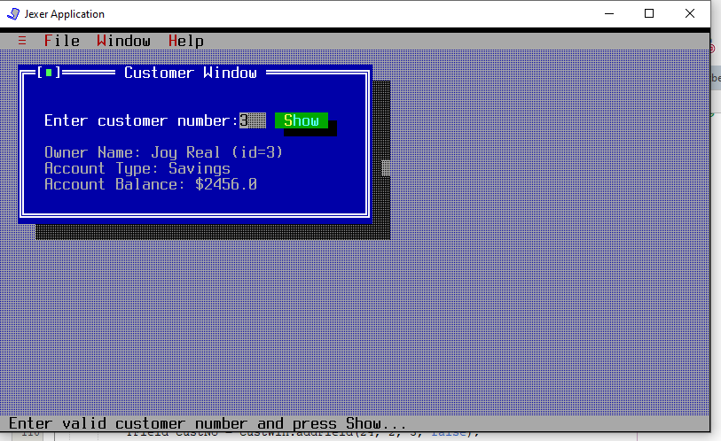
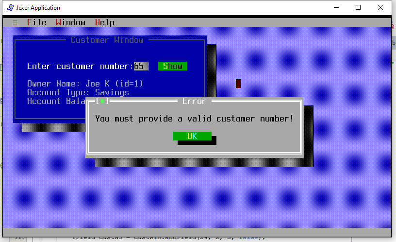
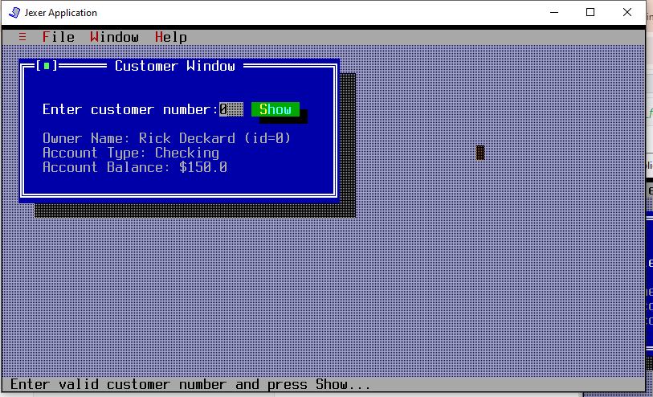
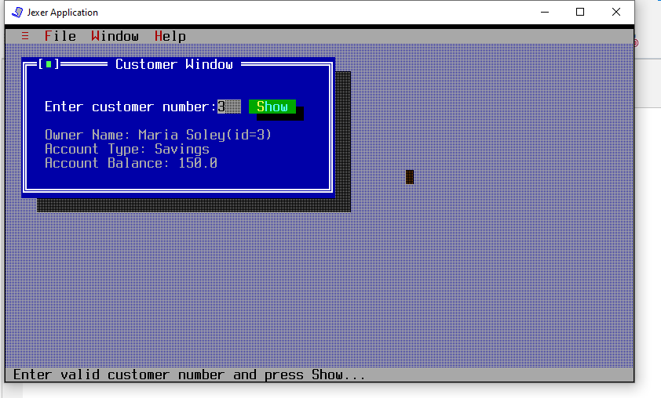
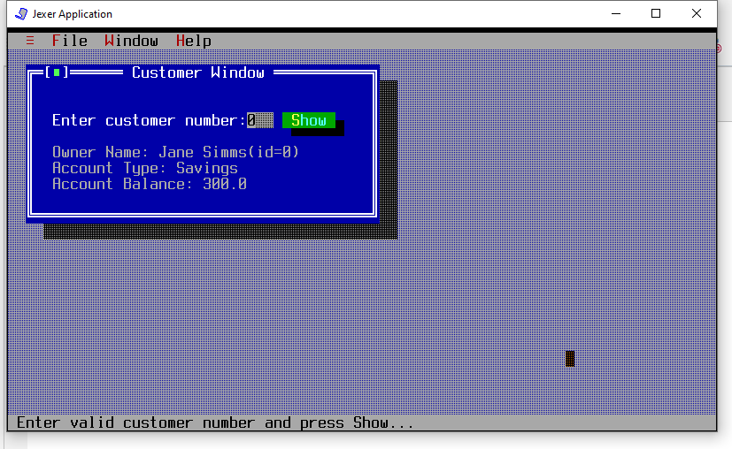

# UI Lab 1

Практичну виконала Жаботинська Софія, студентка 35 групи

## Завдання на 3 бали
Скриншот запущеної програми:



## Завдання на 4 бали

Відредагований код, що містить TDUdemo.java:

```java
public class TUIdemo extends TApplication {

    private static final int ABOUT_APP = 2000;
    private static final int CUST_INFO = 2010;

    /**
     *
     * Точка входу в програму. Створює екземпляр TUIdemo і запускає його в
     * окремому потоці.
     *
     * @param args аргументи командного рядка
     * @throws Exception
     */
    public static void main(String[] args) throws Exception {
        TUIdemo tdemo = new TUIdemo();
        (new Thread(tdemo)).start();
    }

    /**
     *
     * Конструктор класу TUIdemo. Встановлює тип бекенду для Jexer на SWING.
     * Ініціалізує тестові дані про клієнтів та їхні рахунки.
     *
     * @throws Exception
     */
    public TUIdemo() throws Exception {
        super(BackendType.SWING);

        // Ініціалізація тестових даних клієнтів
        Bank.addCustomer("Rick", "Deckard");
        Bank.addCustomer("Joe", "K");
        Bank.addCustomer("Rachael", "");
        Bank.addCustomer("Joy", "Real");

        // Ініціалізація тестових даних рахунків
        Customer rick = Bank.getCustomer(0);
        rick.addAccount(new CheckingAccount(150.00));

        Customer joe = Bank.getCustomer(1);
        joe.addAccount(new SavingsAccount(2.00, 0.02));

        Customer joy = Bank.getCustomer(3);
        joy.addAccount(new SavingsAccount(2456.00, 0.07));

        Customer rachael = Bank.getCustomer(2);
        rachael.addAccount(new CheckingAccount(42.00, 0.06));

        // Створення стандартних меню
        addToolMenu();

        TMenu fileMenu = addMenu("&File");
        fileMenu.addItem(CUST_INFO, "&Customer Info");
        fileMenu.addDefaultItem(TMenu.MID_SHELL);
        fileMenu.addSeparator();
        fileMenu.addDefaultItem(TMenu.MID_EXIT);

        addWindowMenu();

        TMenu helpMenu = addMenu("&Help");
        helpMenu.addItem(ABOUT_APP, "&About...");

        setFocusFollowsMouse(true);

        // Відображення вікна з деталями клієнта
        ShowCustomerDetails();
    }

    @Override
    protected boolean onMenu(TMenuEvent menu) {
        if (menu.getId() == ABOUT_APP) {
            messageBox("About", "\t\t\t\t\t   Just a simple Jexer demo.\n\nCopyright \u00A9 2019 Alexander \'Taurus\' Babich").show();
            return true;
        }
        if (menu.getId() == CUST_INFO) {
            ShowCustomerDetails();
            return true;
        }
        return super.onMenu(menu);
    }

    /**
     *
     * Відображає вікно для введення номера клієнта та показує його детальну
     * інформацію.
     */
    private void ShowCustomerDetails() {
        TWindow custWin = addWindow("Customer Window", 2, 1, 40, 10, TWindow.NOZOOMBOX);
        custWin.newStatusBar("Enter valid customer number and press Show...");

        custWin.addLabel("Enter customer number: ", 2, 2);
        TField custNo = custWin.addField(24, 2, 3, false);
        TText details = custWin.addText("Owner Name: \nAccount Type: \nAccount Balance: ", 2, 4, 38, 8);
        custWin.addButton("&Show", 28, 2, new TAction() {
            @Override
            public void DO() {
                try {
                    int custNum = Integer.parseInt(custNo.getText());

                    Customer customer = Bank.getBank().getCustomer(custNum);

                    if (customer != null) {

                        Account account = customer.getAccount(0);

                        String accountType = account instanceof CheckingAccount ? "Checking" : "Savings";

                        details.setText("Owner Name: " + customer.getFirstName() + " " + customer.getLastName() + " (id=" + custNum + ")\n"
                                + "Account Type: " + accountType + "\n"
                                + "Account Balance: $" + account.getBalance());
                    } else {
                        messageBox("Error", "Customer with number " + custNum + " not found!").show();
                    }
                } catch (Exception e) {
                    messageBox("Error", "You must provide a valid customer number!").show();
                }
            }
        });
    }
}
```





## Завдання на 5 балів

Код на 5 балів міститься в [TUIdemo.java](src/TUIdemo.java)


